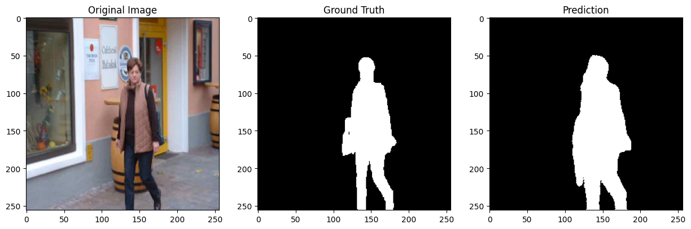

# Human Image Segmentation using U-Net (PyTorch)

## Overview
This project focuses on **human image segmentation** using a deep learning model based on **U-Net architecture** implemented in **PyTorch**.

The goal is to accurately segment human silhouettes from input images using a supervised learning approach.

## Key Features
- U-Net based segmentation model
- PyTorch implementation
- Albumentations for image-mask augmentation
- Binary segmentation with Dice Loss
- GPU training support

## Dataset
All images and masks are included in the `data/` folder of this repository.

## Sample Output
The model predicts a binary mask highlighting the human region in the image:

## How to Run
1. Install required packages: `pip install -r requirements.txt`
2. Open the notebook: `Deep_Learning_with_PyTorch-ImageSegmentation.ipynb`
3. Make sure `PROJECT_DIR` points to your project folder
4. Run all cells

OR
Click the button below to open and run the notebook in Google Colab.

